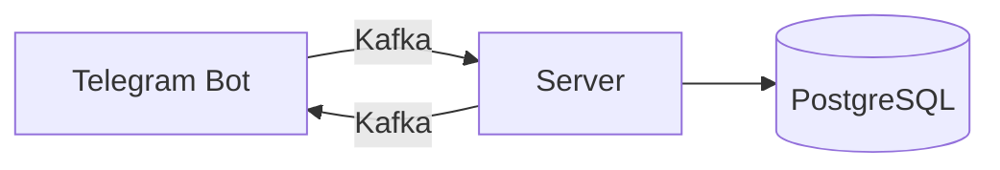

# CalendarOfLife

Приложение, которое помогает пользователям осознать ценность времени, показывая сколько недель они уже прожили.

## Архитектура


## 🌟 Особенности

- 📅 Регистрация пользователей через Telegram бота
- ⏳ Расчет количества прожитых недель
- 🔔 Еженедельные уведомления о прожитых неделях
- 📊 Хранение данных пользователей в PostgreSQL
- 🚀 Асинхронная обработка данных через Kafka

## 🛠 Технологии

- **Backend**: Spring Boot 3, Java 24
- **Database**: PostgreSQL
- **Messaging**: Apache Kafka
- **Telegram API**: TelegramBots
- **Containerization**: Docker

## 🚀 Быстрый старт

### Требования
- Docker и Docker Compose
- Java 24 (для локальной разработки)

### Запуск с Docker

1. Клонируйте репозиторий:
   ```bash
   git clone https://github.com/0-Bober-0/CalendarOfLife
   cd life-weeks-calendar
2. Запустите сервисы:
   ```bash
   docker-compose up -d
3. Приложение будет доступно:
   + Если свободны используемые порты - (2181, 5432, 8081, 8082, 8083, 9000, 9092)
   + Telegram Bot - ищите @CalendarOf_Life_bot в Telegram
   + Adminer (DB UI) - http://localhost:8081
   + Kafdrop (Kafka UI) - http://localhost:9000
     
## 📈 Планы по развитию

- **🌐 Веб-интерфейс с визуализацией**  
  Интерактивная диаграмма прожитых недель с возможностью отмечать важные события и просматривать статистику в красивом интерфейсе

- **📅 Ежемесячная статистика**  
  Автоматические отчеты с анализом прошедшего месяца: достижения, важные события и персональные инсайты

- **🔌 Интеграция с Google Calendar**  
  Синхронизация событий из календаря для автоматического учета важных моментов в вашей жизни

- **🎯 Система целей и достижений**  
  Постановка целей на неделю/месяц/год с трекингом прогресса и мотивационными напоминаниями

- **📱 Мобильное приложение**  
  Нативные клиенты для iOS и Android с push-уведомлениями и виджетами

- **🤖 AI-ассистент**  
  Персональный помощник для анализа вашей продуктивности и предложения улучшений

## 🤝 Как помочь проекту

- **🛠 Разработка**  
  Присоединяйтесь к разработке новых функций или улучшению существующего кода

- **🐞 Тестирование**  
  Помогите находить и фиксировать баги, тестируя приложение

- **📖 Документация**  
  Улучшайте документацию, пишите гайды и инструкции

- **🌍 Локализация**  
  Помогите перевести приложение на другие языки

- **💡 Идеи**  
  Предлагайте новые фичи и улучшения через Issues

**Процесс контрибьютинга:**
1. Форкните репозиторий (`git clone https://github.com/0-Bober-0/CalendarOfLife`)
2. Создайте ветку для вашей фичи (`git checkout -b feature/amazing-feature`)
3. Сделайте коммит изменений (`git commit -m 'Add some amazing feature'`)
4. Запушьте ветку (`git push origin feature/amazing-feature`)
5. Откройте Pull Request с описанием ваших изменений

## 📜 Лицензия

**MIT License** - разрешает свободное использование, модификацию и распространение кода с указанием авторства.  
Полный текст лицензии доступен в файле [LICENSE](LICENSE).

**Основные условия:**
- Можно свободно использовать в коммерческих проектах
- Обязательное указание авторства
- Предоставляется "как есть", без гарантий
- Ответственность лежит на пользователе
